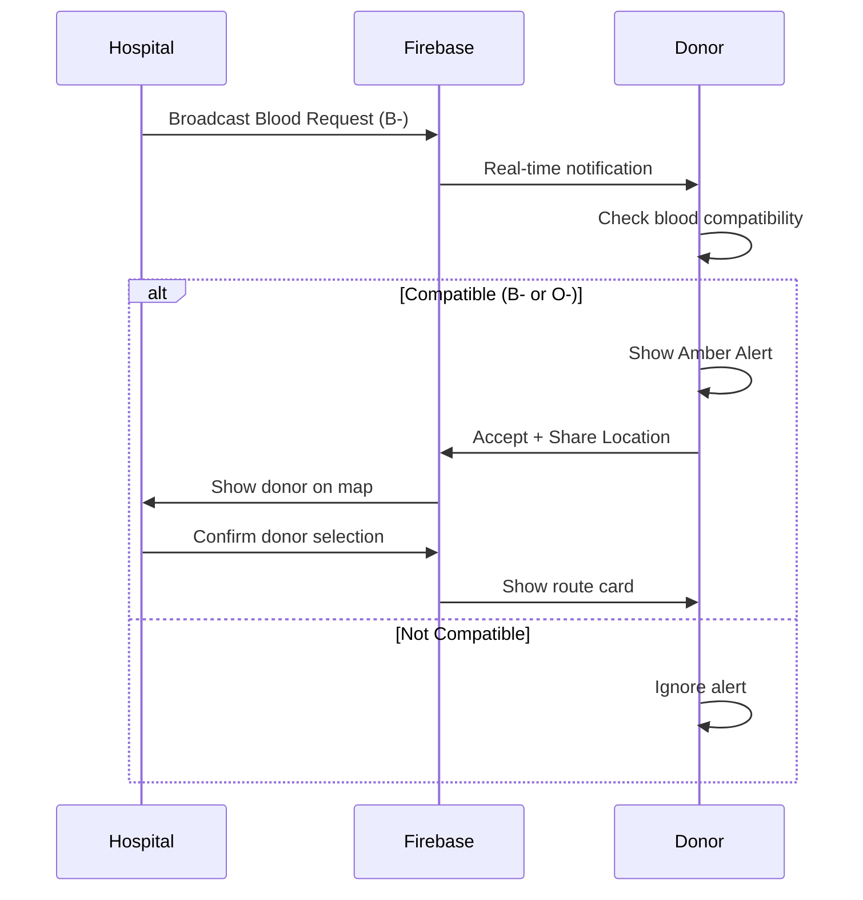

# 🩸 Life Stream

> Real-time Emergency Blood Donation Platform

Life Stream connects hospitals with nearby blood donors in emergencies using real-time location tracking and instant notifications.


---

## ✨ Features

### 🏥 Hospital Dashboard
- **Emergency Blood Request** - Select blood type and broadcast urgent requests
- **Live Donor Tracking** - See donors on map with real-time location updates
- **Multi-Select Donors** - Choose specific donors to confirm for donation
- **ETA & Distance** - Real-time estimated arrival times with traffic status
- **Privacy-First** - Only see anonymous donor IDs until confirmation

### 🧑‍⚕️ Donor Interface
- **Amber Alert System** - Full-screen emergency notifications with vibration
- **Blood Type Filtering** - Only receive alerts for compatible blood types
- **Do Not Disturb Mode** - Set a timer (15min - 3hrs) to pause alerts
- **Unique Identity** - Auto-generated profile with avatar, name, and history
- **Live Location Sharing** - Share precise location only after accepting
- **Route Navigation** - Direct link to Google Maps for directions

### 🔒 Privacy Features
- **H3 Hexagon Privacy** - Approximate location shown until donor accepts
- **Anonymous IDs** - Hospital sees `Donor_A3X7K` format, not real names
- **Consent-Based Sharing** - Location only shared after explicit accept

---

## 🛠️ Tech Stack

| Category | Technology |
|----------|------------|
| Framework | Next.js 16 (App Router, Turbopack) |
| Language | TypeScript 5 |
| Styling | Tailwind CSS 4, shadcn/ui |
| Real-time | Firebase Realtime Database |
| Maps | Leaflet, react-leaflet |
| Geospatial | H3 (Uber's hexagonal grid) |
| State | React Hooks |

---

## 🚀 Getting Started

### Prerequisites
- Node.js 18+
- pnpm (recommended) or npm

### Installation

```bash
# Clone the repository
git clone https://github.com/yourusername/life-stream.git
cd life-stream

# Install dependencies
pnpm install

# Start development server
pnpm dev
```

Open [http://localhost:3000](http://localhost:3000) in your browser.

### Firebase Setup

1. Create a project at [Firebase Console](https://console.firebase.google.com)
2. Enable **Realtime Database** (Start in test mode)
3. Add a Web App and copy the config
4. The config is already in `src/lib/firebase.ts`

---

## 📱 Testing

### Same Device (Recommended for Demo)
1. Open `/hospital` in one browser tab
2. Open `/donor` in another tab (or incognito for different identity)
3. Send request from hospital → Donor receives alert

### Cross-Device
1. Find your PC's local IP (e.g., `192.168.0.100`)
2. On PC: Open `http://localhost:3000/hospital`
3. On Phone: Open `http://[PC-IP]:3000/donor`
4. Both sync via Firebase Realtime Database

> ⚠️ **Note**: Mobile GPS requires HTTPS. In development over HTTP, a fallback location is used.

---

## 📁 Project Structure

```
src/
├── app/
│   ├── page.tsx          # Landing page
│   ├── donor/page.tsx    # Donor interface
│   ├── hospital/page.tsx # Hospital dashboard
│   └── globals.css       # Global styles
├── components/
│   ├── ui/               # shadcn/ui components
│   ├── AmberAlert.tsx    # Emergency notification
│   ├── DonorMap.tsx      # Donor's map view
│   ├── HospitalMap.tsx   # Hospital's map with radar
│   ├── DonorHeader.tsx   # Donor profile header
│   ├── DNDTimer.tsx      # Do Not Disturb toggle
│   └── ...
├── lib/
│   ├── firebase.ts       # Firebase config
│   ├── realtime.ts       # Real-time communication
│   ├── geo.ts            # Geolocation & H3 utilities
│   ├── dnd.ts            # DND state management
│   ├── donor-identity.ts # Unique identity generator
│   └── alerts.ts         # Vibration utilities
└── types/
    └── index.ts          # TypeScript interfaces
```

---

## 🩸 Blood Type Compatibility

The app filters alerts based on proper blood donation rules:

| Donor Type | Can Donate To |
|------------|---------------|
| O- | Everyone (Universal Donor) |
| O+ | O+, A+, B+, AB+ |
| A- | A-, A+, AB-, AB+ |
| A+ | A+, AB+ |
| B- | B-, B+, AB-, AB+ |
| B+ | B+, AB+ |
| AB- | AB-, AB+ |
| AB+ | AB+ only |

---

## 🗺️ How It Works



---

## 🔧 Configuration

### Environment Variables (Optional)

Create `.env.local` for custom Firebase config:

```env
NEXT_PUBLIC_FIREBASE_API_KEY=your_api_key
NEXT_PUBLIC_FIREBASE_DATABASE_URL=your_database_url
NEXT_PUBLIC_FIREBASE_PROJECT_ID=your_project_id
```

### Next.js Config

Allowed dev origins for mobile testing are in `next.config.ts`.

---

## 📄 License

MIT License - feel free to use for hackathons, learning, or production!

---

## 🙏 Acknowledgments

- [shadcn/ui](https://ui.shadcn.com) for beautiful components
- [Leaflet](https://leafletjs.com) for maps
- [H3](https://h3geo.org) for hexagonal geospatial indexing
- [DiceBear](https://dicebear.com) for avatar generation
- [Firebase](https://firebase.google.com) for real-time sync

---

<p align="center">
  Made with ❤️ for saving lives
</p>
