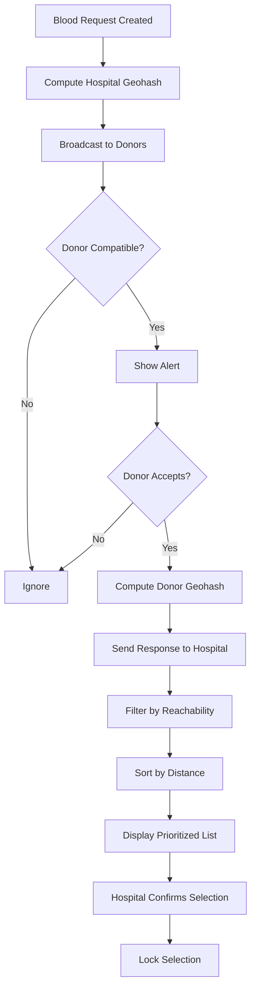

# Algorithm Design & Analysis

> Pseudocode and complexity analysis for the Geohash-Based Blood Donation Emergency Response System

---

## Algorithm Overview



---

## Pseudocode

### 1. Geohash Encoding (Precision = 5)

```
FUNCTION encodeGeohash(lat, lng, precision = 5):
    INPUT: latitude (-90 to 90), longitude (-180 to 180)
    OUTPUT: geohash string of length 'precision'
    
    BASE32 = "0123456789bcdefghjkmnpqrstuvwxyz"
    
    minLat = -90, maxLat = 90
    minLng = -180, maxLng = 180
    
    hash = ""
    bit = 0
    ch = 0
    isLng = true  // Start with longitude
    
    WHILE length(hash) < precision:
        IF isLng:
            mid = (minLng + maxLng) / 2
            IF lng >= mid:
                SET bit in ch
                minLng = mid
            ELSE:
                maxLng = mid
        ELSE:
            mid = (minLat + maxLat) / 2
            IF lat >= mid:
                SET bit in ch
                minLat = mid
            ELSE:
                maxLat = mid
        
        isLng = NOT isLng
        bit = bit + 1
        
        IF bit == 5:
            hash = hash + BASE32[ch]
            bit = 0
            ch = 0
    
    RETURN hash
```

**Geohash Role**: Spatial index to reduce search space. Not used for final matching.

---

### 2. Haversine Distance Calculation

```
FUNCTION calculateDistance(loc1, loc2):
    INPUT: loc1 = {lat, lng}, loc2 = {lat, lng}
    OUTPUT: distance in kilometers
    
    R = 6371  // Earth's radius in km
    
    dLat = toRadians(loc2.lat - loc1.lat)
    dLng = toRadians(loc2.lng - loc1.lng)
    
    a = sin(dLat/2)² + cos(loc1.lat) × cos(loc2.lat) × sin(dLng/2)²
    c = 2 × atan2(√a, √(1-a))
    
    distance = R × c
    
    RETURN distance
```

**Role**: Used for exact reachability check and distance prioritization.

---

### 3. Reachability Check

```
FUNCTION isReachable(donor, hospital, maxRadius = 15):
    INPUT: donor object, hospital location, max radius in km
    OUTPUT: boolean
    
    // Check availability
    IF donor.status ≠ "active":
        RETURN false
    
    // Check distance
    distance = calculateDistance(donor.location, hospital.location)
    
    IF distance > maxRadius:
        RETURN false
    
    RETURN true
```

**Reachability Logic**: Combines spatial distance with availability status.

---

### 4. Nearest-Distance Prioritization

```
FUNCTION getPrioritizedDonors(candidates, hospitalLocation):
    INPUT: array of candidate donors, hospital location
    OUTPUT: sorted array of reachable donors (nearest first)
    
    reachable = []
    
    // Step 1: Filter by reachability
    FOR EACH donor IN candidates:
        IF isReachable(donor, hospitalLocation):
            donor.distance = calculateDistance(donor.location, hospitalLocation)
            reachable.APPEND(donor)
    
    // Step 2: Sort by distance (ascending)
    SORT reachable BY distance ASC
    
    RETURN reachable
```

**Key Point**: Distance is used for RANKING, not filtering.

---

### 5. Complete Emergency Response Algorithm

```
ALGORITHM EmergencyBloodResponse:

INPUT:
    - bloodType: required blood type
    - hospitalLocation: {lat, lng}
    - allDonors: registered donors in system

OUTPUT:
    - selectedDonor: confirmed donor for emergency

PROCEDURE:

    // Phase 1: Request Broadcast
    request = createRequest(bloodType, hospitalLocation)
    request.geohash = encodeGeohash(hospitalLocation, 5)
    broadcast(request)

    // Phase 2: Collect Responses
    responses = []
    WHILE acceptingResponses:
        FOR EACH donor IN allDonors:
            IF isBloodCompatible(donor.bloodType, bloodType):
                IF NOT donorInDND(donor):
                    showAlert(donor, request)
                    IF donor.accepts:
                        donor.geohash = encodeGeohash(donor.location, 5)
                        responses.APPEND(donor)

    // Phase 3: Prioritization
    prioritizedDonors = getPrioritizedDonors(responses, hospitalLocation)

    // Phase 4: Selection (Hospital Decision)
    selectedDonor = hospital.select(prioritizedDonors)

    // Phase 5: Lock Selection
    lockSelection(selectedDonor, request)
    notifyDonor(selectedDonor, hospitalLocation)

    RETURN selectedDonor
```

---

## Complexity Analysis

### Time Complexity

| Operation | Complexity | Explanation |
|-----------|------------|-------------|
| Geohash Encoding | O(p) | p = precision (5 iterations) |
| Haversine Distance | O(1) | Fixed arithmetic operations |
| Filter Reachable Donors | O(n) | n = number of candidate donors |
| Sort by Distance | O(n log n) | Standard comparison sort |
| **Overall Pipeline** | **O(n log n)** | Dominated by sorting step |

### Space Complexity

| Operation | Complexity | Explanation |
|-----------|------------|-------------|
| Geohash String | O(p) | p characters stored |
| Donor Array | O(n) | n donors in memory |
| Sorted Copy | O(n) | New array for sorted result |
| **Overall** | **O(n)** | Linear in number of donors |

---

## Panel-Safe Statements

> "Geohash is used as a spatial index to reduce search space."

> "Reachability is approximated using spatial distance and availability."

> "Distance is used for ranking, not filtering. Nearest donor is prioritized."

---

## Inputs and Outputs Summary

### System Inputs
- Hospital location (lat, lng)
- Required blood type
- Donor locations and blood types
- Availability status

### System Outputs
- Prioritized list of compatible, reachable donors
- ETA estimates for each donor
- Confirmed donor selection
