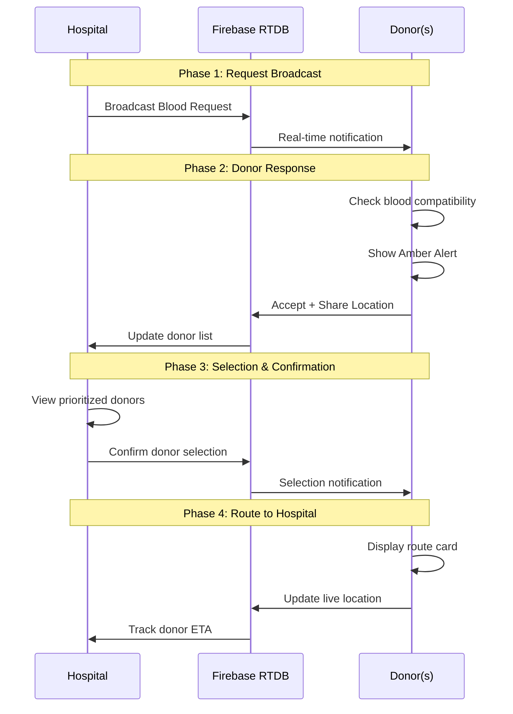

# Process Flow - Early Implementation

> Step-by-step process flow for the Geohash-Based Blood Donation Emergency Response System

---

## Overview Diagram



---

## Detailed Process Flow

### Step 1: Hospital Initiates Emergency Request

**Component**: Hospital Dashboard (`/hospital`)

**Process**:
1. Hospital staff opens dashboard
2. Selects required blood type from dropdown
3. Sets urgency level (Critical/Urgent/Normal)
4. Clicks "Send Alert" button

**System Actions**:
- Generate unique Request ID
- Compute hospital geohash (precision=5)
- Store request in Firebase: `lifestream/activeRequest`
- Set status = `pending`

---

### Step 2: Request Broadcast to Donors

**Component**: Firebase Realtime Database

**Process**:
1. Request document created at `lifestream/activeRequest`
2. All subscribed donor clients receive update
3. Real-time sync via `onValue` listener

**Data Transmitted**:
```json
{
  "id": "req-uuid",
  "hospitalId": "hospital-001",
  "hospitalLocation": { "lat": 12.9716, "lng": 77.5946 },
  "hospitalGeohash": "tdr1w",
  "bloodType": "O-",
  "status": "pending",
  "timestamp": 1704110400000
}
```

---

### Step 3: Donor Receives and Processes Request

**Component**: Donor Interface (`/donor`)

**Process**:
1. Request arrives via Firebase subscription
2. Blood type compatibility check performed
3. If compatible AND not in DND mode:
   - Display Amber Alert overlay
   - Trigger device vibration
4. If not compatible: Ignore silently

**Compatibility Logic**:
- Universal donor (O-) can donate to all
- Exact match always compatible
- Type-specific compatibility matrix applied

---

### Step 4: Donor Accepts Request

**Component**: AmberAlert Component

**Process**:
1. Donor reads emergency details
2. Clicks "Accept" button
3. System requests geolocation permission
4. Location captured and transmitted

**System Actions**:
- Compute donor geohash (precision=5)
- Compute donor H3 index (privacy zone)
- Calculate distance to hospital
- Store response in Firebase: `lifestream/responses/{donorId}`
- Begin live location tracking

---

### Step 5: Hospital Views Responding Donors

**Component**: Hospital Map (HospitalMap.tsx)

**Process**:
1. Subscribe to `lifestream/responses`
2. For each responding donor:
   - Calculate exact Haversine distance
   - Estimate ETA based on traffic
   - Display on map
3. Apply distance prioritization
4. Show donors sorted by proximity (nearest first)

**Privacy Protection**:
- Before confirmation: Show H3 cell center (approximate)
- After confirmation: Show exact location

---

### Step 6: Hospital Confirms Donor Selection

**Component**: Hospital Dashboard

**Process**:
1. Hospital reviews prioritized donor list
2. Selects one or more donors
3. Clicks "Confirm Selection"
4. Selection locked in Firebase

**System Actions**:
- Store selection in `lifestream/selection`
- Update request status to `active`
- Notify selected donors
- Release unselected donors

**Locking Behavior**:
- Post-confirmation lock prevents changes
- First-come locking reserved for future implementation

---

### Step 7: Donor Navigates to Hospital

**Component**: RouteCard Component

**Process**:
1. Selected donor receives confirmation
2. Route card displays:
   - Hospital name and address
   - Distance and ETA
   - Google Maps navigation link
3. Donor travels to hospital
4. Live location updates sent to hospital

---

### Step 8: Request Completion

**Component**: Hospital Dashboard

**Process**:
1. Hospital marks donation complete
2. Request status updated to `fulfilled`
3. Firebase data cleared
4. System ready for next request

---

## Component Mapping

| Step | Process | System Component |
|------|---------|------------------|
| 1 | Create request | `broadcastRequest()` |
| 2 | Broadcast | Firebase RTDB |
| 3 | Receive | `subscribeToRequests()` |
| 4 | Accept | `sendDonorResponse()` |
| 5 | View donors | `subscribeToResponses()` |
| 6 | Confirm | `confirmDonorSelection()` |
| 7 | Navigate | `updateLiveLocation()` |
| 8 | Complete | `clearRequest()` |

---

## Panel-Safe Statement

> "Firebase is used only as a lightweight datastore for early implementation."
